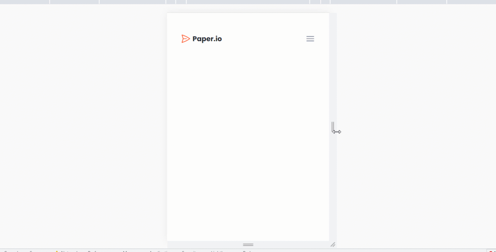

Greetings! 👋

This is just a simple demo, showing you how to create a repsonsive navbar in react (or any web app) using tailwindcss. You can clone this repo and experiment with it.

Live Demo: https://lypras.github.io/Tailwindcss-React-Responsive-Navbar/

#### Leave a star ⭐, Cheers!
